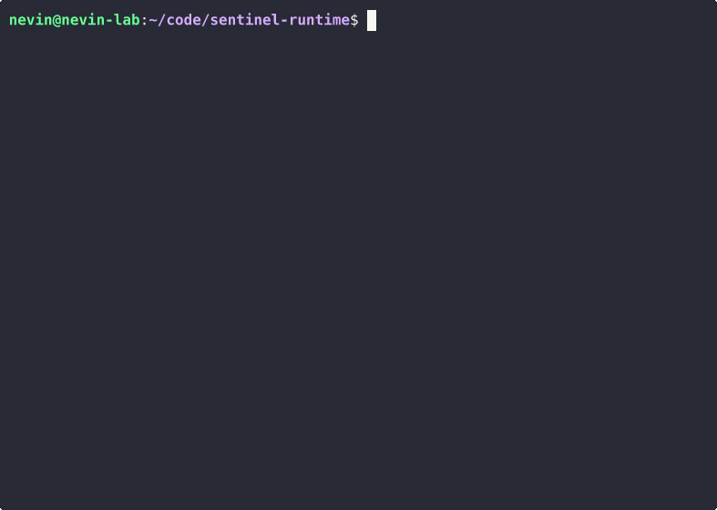

# Sentinel Runtime: Host-Based Active Defense


> **Status:** Research Artifact (Active)
> **Current Capability:** M3.0 (Semantic Understanding & Behavioral Policy)
> **Target:** CISPA / Saarland MSc Application

## Abstract

**Sentinel Runtime** is a Linux runtime defense system designed to investigate syscall-level observability and semantic enforcement.

Unlike traditional signature-based AVs, Sentinel leverages `ptrace` to establish a closed-loop runtime control system. It connects a high-speed C interception kernel to a Python-based **Cognitive Engine (WiSARD)** to evaluate process intent against behavioral policies in real-time.

**System Security Research Dossier:** [nevinshine.github.io/system-security-research-dossier](https://nevinshine.github.io/runtime-security-dossier/)

---

## M3.0: Cognitive Defense (Live Demo)

Demonstration of **Sentinel Runtime** operating in "Cognitive Mode." The engine actively translates raw file paths into security concepts (e.g., `/etc/shadow` → `CRITICAL_AUTH`) to enforce higher-level behavioral policies.

### View 1: The Sentinel (Kernel Interceptor)
**Scenario:** User attempts to delete a sensitive file (`rm protected.txt`).
**Result:** The kernel injects an `EPERM` error, blocking the execution.


### View 2: The Brain (Cognitive Engine)
**Analysis:** Real-time logs showing the transition from "Context Awareness" (Green) to "Threat Detection" (Red). Note the **SEMANTIC TAG** column identifying the file as `SENSITIVE_USER_FILE`.



---

## Capability Milestone Status

| Feature | Milestone | Status | Description |
| :--- | :--- | :--- | :--- |
| **Deep Introspection** | M0.8 | [COMPLETE] | Argument extraction via `PTRACE_PEEKDATA`. |
| **Online Inference Loop** | M1.0 | [COMPLETE] | Real-time decision pipeline via Named Pipes (IPC). |
| **Recursive Process Tracking** | M2.0 | [COMPLETE] | Tracing dynamic trees via `PTRACE_O_TRACEFORK`. |
| **Universal Extraction** | M2.1 | [COMPLETE] | **The Universal Eye.** Map-based extraction for `unlink`, `openat`, `execve`. |
| **Active Blocking** | M2.1 | [COMPLETE] | **Kill Switch.** Injecting `EPERM` verdicts to prevent execution. |
| **Semantic Understanding** | M3.0 | [OPERATIONAL] | **Cognitive Engine.** Translating paths to concepts (e.g., `CRITICAL_AUTH`). |

---

## Research Roadmap

* **M1.0: The Closed Loop (Completed)**
    * Connected C Engine to Python Brain via IPC Pipes.
    * Established the ALLOW/BLOCK decision protocol.
* **M2.0: Recursive Vision (Completed)**
    * Implemented `PTRACE_O_TRACEFORK` to track process trees (Parent -> Child).
* **M2.1: Universal Defense (Completed)**
    * **Stealth Tracking:** Added `PTRACE_O_TRACEVFORK` to detect optimized shells (`dash`, `sh`).
    * **Active Blocking:** Validated "Kill Switch" for file deletion attempts.
* **M3.0: Semantic Understanding (CURRENT)**
    * **Knowledge Base:** Implemented `SemanticMapper` (`semantic.py`) with regex taxonomy.
    * **Behavioral Policy:** Moving from "Signature Based" (String Match) to "Concept Based" (Tag Match).
* **M3.1: State Machine (Next)**
    * **Sequence Detection:** Detect multi-step attacks (e.g., "Open" -> "Read" -> "Socket Write" = Exfiltration).

---

## Architecture (Refactored M3.0)

Sentinel operates as a modular closed-loop runtime control system:

### 1. Systems Layer (C / Kernel Space)
*Located in `src/engine/`*
- **Interception Engine (`main.c`):** A recursive `ptrace` monitor supporting `FORK`, `CLONE`, and `VFORK`.
- **Universal Map (`syscall_map.h`):** A research artifact defining the "DNA" of syscalls (Registers, Types, Names).
- **Visualization (`logger.c`):** Real-time tree hierarchy rendering.

### 2. Analysis Layer (Python / Data Space)
*Located in `src/analysis/`*
- **Neural Engine (`brain.py`):** The decision center. Parses `SYSCALL:verb:arg` signals and issues Block/Allow verdicts.
- **Semantic Mapper (`semantic.py`):** **[NEW]** The Knowledge Base. Classifies raw arguments into Semantic Tags.

---

## Usage

Sentinel M3.0 uses a standard `make` build system.

### 1. Build the Artifact
```bash
make clean && make
# Compiles ./bin/sentinel

```

### 2. Execute Control Loop

You must run the Analysis Engine (Brain) and the Kernel Interceptor (Sentinel) simultaneously.

**Terminal 1 (The Cognitive Brain):**

```text
$ python3 src/analysis/brain.py
+ [INFO] Neural Engine Online (M3.0 Cognitive Mode).
+ [INFO] Semantic Knowledge Base Loaded.
---------------------------------------------------------------------------
VERDICT    | ACTION     | SEMANTIC TAG         | PATH
---------------------------------------------------------------------------
ALLOW      | execve     | SYSTEM_BINARY        | /bin/ls
BLOCK      | unlink     | SENSITIVE_USER_FILE  | protected.txt

```

**Terminal 2 (The Sentinel):**

```bash
# Syntax: ./bin/sentinel <trigger_word> <target_binary>
sudo ./bin/sentinel test /bin/sh

# Inside the monitored session:
# touch protected.txt
# rm protected.txt
rm: cannot remove 'protected.txt': Operation not permitted

```

---

*Research Author: Nevin Shine.*